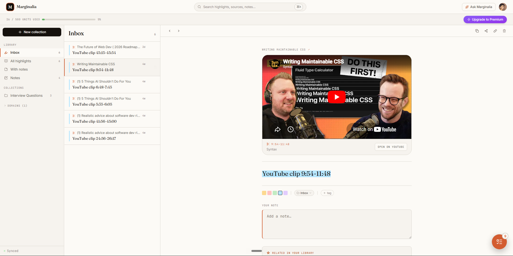
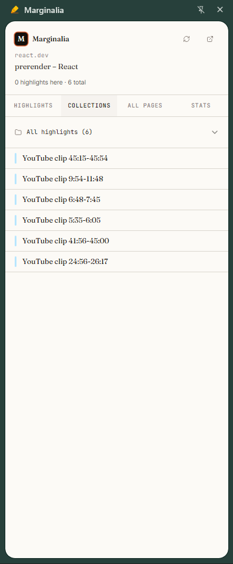
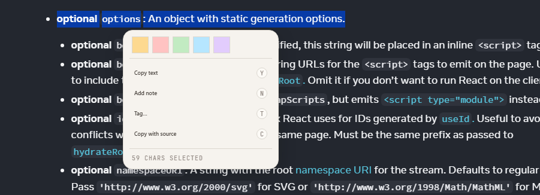
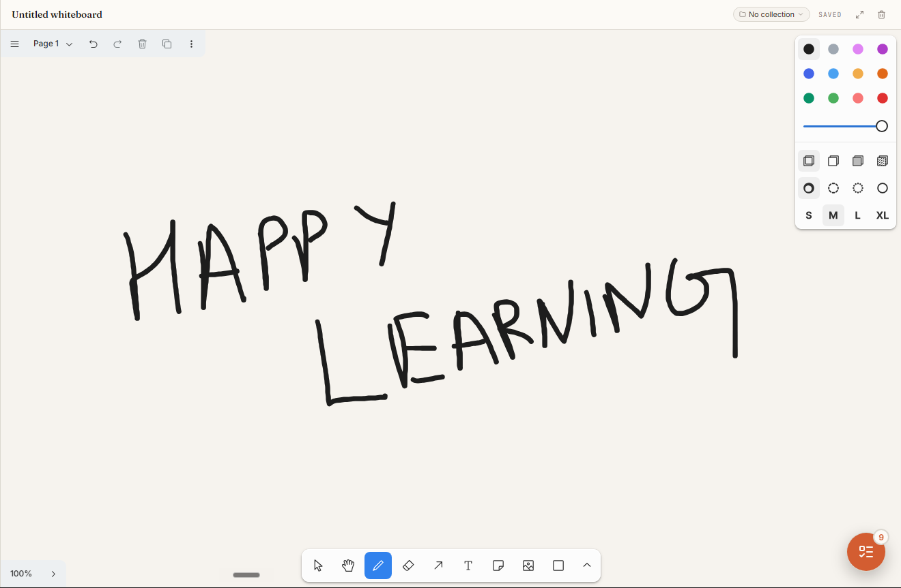

<div align="center">

# Marginalia

**A modern web highlighter — save, organise, and revisit what you read.**

Highlight any page or YouTube video from a Chrome extension, then read everything back in a fast, focused dashboard. Highlights, notes, whiteboards, collections, and to‑dos stay in sync in real time.

<!-- Replace the badges below with your own once CI / store listing exist -->


</div>

---

## Table of contents

- [What is Marginalia?](#what-is-marginalia)
- [Screenshots](#screenshots)
- [Feature tour](#feature-tour)
- [How it works](#how-it-works)
- [Architecture](#architecture)
- [Project structure](#project-structure)
- [Getting started](#getting-started)
- [Environment variables](#environment-variables)
- [Available scripts](#available-scripts)
- [Plans & limits](#plans--limits)
- [Testing](#testing)
- [Tech stack](#tech-stack)

---

## What is Marginalia?

Marginalia turns the web into something you can write in the margins of. Select text on **any** website — a blog post, documentation, a news article — and save it as a colour‑coded highlight with an optional note and tags. On YouTube, mark the start and end of a moment to save a **video clip** you can replay later.

Everything you capture flows into a personal **dashboard** where it can be searched, tagged, grouped into collections, and expanded into longer **notes** or freeform **whiteboards**. A floating **to‑do widget** travels with you across every page so you can turn what you read into action.

The product is two surfaces over one real‑time backend:

| Surface              | What it's for                                                                                                  |
| -------------------- | -------------------------------------------------------------------------------------------------------------- |
| **Chrome extension** | Capture highlights & clips, quick‑review the current page, manage to‑dos — without leaving the site you're on. |
| **Web dashboard**    | The home for everything you've saved: search, organise, annotate, and revisit.                                 |

Both are backed by **Convex**, which keeps every device updated live — highlight something in the browser and it appears in the dashboard instantly, no refresh required.

---

## Screenshots

> _Screenshots live in [`docs/screenshots/`](docs/screenshots/) — see [the capture guide](docs/screenshots/README.md) for what each image should show._

### Dashboard



_The three‑pane dashboard: collections sidebar, highlight list, and a detail pane with the note editor and source metadata._

### Browser extension



_The extension side panel reviewing highlights for the current page, all pages, collections, and per‑domain stats._

---

## Feature tour

### ✍️ Highlight anything



- Select text on any site and pick from a palette of highlight colours via an inline toolbar.
- Highlights are **re‑anchored intelligently** on every visit using surrounding text and position scoring, so they survive minor page changes instead of breaking the moment the DOM shifts.
- Add a **note** and **tags** to any highlight, inline.

### 🎬 YouTube clips

- A player button lets you mark a **clip start and end** on a video and save it as a highlight.
- Clips remember the video, channel, and timestamps, and replay directly from the dashboard.

### 🗂️ Organise into collections

- Group highlights **and** notes into named collections.
- Special views for _Inbox_, _All_, and _Notes_, plus a fast **command palette** (`⌘/Ctrl‑K`) to jump anywhere.

### 📝 Notes & whiteboards



- A rich‑text editor (Lexical) for long‑form notes — headings, lists, code blocks, links, checklists, and Markdown shortcuts.
- Freeform **whiteboards** (tldraw) for visual thinking, attachable to any collection.

### ✅ To‑dos that follow you

- A floating to‑do widget is available on **every** page, including the dashboard.
- Due dates with an overdue indicator, **recurring** todos (daily / weekly / monthly), drag‑to‑reorder sorting, and an automatic end‑of‑day deadline for unscheduled items.
- Attach a link (and title) to a todo so you can jump back to the source.

### 🔭 Review on the page

- The extension **side panel** and **popup** show highlights for the current page, all pages, and per‑domain stats — without opening the dashboard.
- Keyboard shortcuts: `Alt+M` opens the side panel, `Alt+Shift+M` toggles highlighting.

### ⚡ Real‑time everywhere

- Built on Convex, so saves propagate live across the extension and every open dashboard tab.

---

## How it works

### 1. Sign in

You authenticate on the web dashboard with **Google** (via Convex Auth). A local credentials provider is available in development for fast iteration and end‑to‑end tests.

### 2. Pair the extension

The extension links to your account with a short‑lived **pairing code**:

```
Dashboard  ──"Connect extension"──▶  generates code  (e.g. MARG-AB3D-7KQ9, 10‑min TTL)
                                            │
Extension  ──enter code──▶ exchangePairingCode ──▶ issues a long‑lived session token
                                            │
              token is stored in the extension and sent with every API call
```

Pairing codes are single‑use and expire after 10 minutes; exchanging one mints a persistent `extensionSessions` token tied to your user.

### 3. Capture

As you browse, the **content script** watches your text selections and renders the highlight toolbar inside a Shadow DOM (so it never clashes with the host page's styles). Saving a highlight stores the selected text **plus anchoring metadata** — a text prefix/suffix and approximate position — so it can be found again later.

### 4. Re‑anchor & repaint

On every page load, the content script walks the document's text nodes and re‑locates each saved highlight by matching its text and context, scoring candidates by position. Matches are repainted as `<mark>` elements; a mutation observer re‑applies them as the page changes (SPAs, lazy content, YouTube navigation).

### 5. Review & organise

Everything syncs to Convex and shows up in the dashboard and the extension's side panel, where you can search, tag, annotate, group into collections, and expand into notes or whiteboards.

---

## Architecture

```
┌────────────────────────┐         ┌────────────────────────┐
│   Chrome Extension      │         │     Web Dashboard       │
│   (MV3, React, Vite)    │         │     (React 19, Vite)    │
│                         │         │                         │
│  • content script       │         │  • highlights / notes   │
│    (highlight + anchor) │         │  • collections / search │
│  • popup                │         │  • notes & whiteboards  │
│  • side panel           │         │  • todos / settings     │
│  • background worker     │         │  • billing / pricing    │
└───────────┬────────────┘         └───────────┬────────────┘
            │  session token                   │  Convex Auth (Google)
            │                                   │
            └───────────────┬───────────────────┘
                            ▼
              ┌──────────────────────────────┐
              │           Convex              │
              │  queries · mutations · HTTP   │
              │                               │
              │  highlights · notes · todos   │
              │  collections · settings       │
              │  pairing · sessions · billing │
              └──────────────────────────────┘
```

- **Frontend(s):** React 19 + TypeScript, built with Vite, styled with Tailwind CSS and Radix UI primitives. Shared design tokens live in [`tokens/`](tokens/).
- **Backend:** [Convex](https://convex.dev) provides the database, reactive queries, mutations, and HTTP actions. Schema is defined in [`convex/schema.ts`](convex/schema.ts).
- **Auth:** [`@convex-dev/auth`](https://labs.convex.dev/auth) with a Google OAuth provider (plus a dev‑only credentials provider).
- **Payments:** Razorpay integration for the Premium plan (see [`convex/billing.ts`](convex/billing.ts)).

---

## Project structure

This is a **pnpm workspace** monorepo:

```
.
├── convex/            # Backend: schema, queries, mutations, auth, billing, HTTP actions
│   ├── schema.ts          # Data model (highlights, notes, todos, collections, …)
│   ├── highlights.ts      # Highlight CRUD + plan enforcement
│   ├── notes.ts           # Notes & whiteboards
│   ├── collections.ts     # Collections
│   ├── extensionAuth.ts   # Pairing codes ↔ extension session tokens
│   ├── billing.ts / plan.ts  # Razorpay + free‑plan usage limits
│   └── auth.ts / http.ts  # Convex Auth config + HTTP endpoints
│
├── web/               # Dashboard (React 19 + Vite)
│   └── src/
│       ├── routes/        # Dashboard, Reader, Settings, SignIn
│       ├── components/     # Highlight list/detail, notes, whiteboard, command palette, …
│       └── store.ts        # Zustand UI state
│
├── extension/         # Chrome extension (Manifest V3 + Vite + CRXJS)
│   ├── manifest.json
│   └── src/
│       ├── content/        # Content script: selection, anchoring, marks, toolbar, todo, youtube
│       ├── popup/          # Toolbar popup
│       ├── sidepanel/      # Side panel (highlights / all pages / collections / stats)
│       ├── background/     # Service worker
│       └── lib/            # Convex client, storage, messaging, URL helpers
│
├── e2e/               # Playwright end‑to‑end tests (dashboard + extension)
├── tokens/            # Shared design tokens (CSS + Tailwind)
└── pnpm-workspace.yaml
```

---

## Getting started

### Prerequisites

- **Node.js** 20+
- **pnpm** 10+ (`corepack enable` will provide it)
- A **Convex** account (free) — `npx convex` will guide you through setup
- _(Optional)_ Google OAuth credentials for real sign‑in; _(optional)_ Razorpay keys for billing

### 1. Install

```bash
pnpm install
```

### 2. Configure environment

```bash
cp .env.example .env.development
```

Fill in the values described in [Environment variables](#environment-variables).

### 3. Start the backend

```bash
pnpm convex        # runs `convex dev` — provisions your deployment and watches functions
```

This prints your `VITE_CONVEX_URL`; add it to your env file.

### 4. Run the dashboard

```bash
pnpm dev:web       # Vite dev server, default http://localhost:5173
```

### 5. Build & load the extension

```bash
pnpm dev:ext       # builds the extension in watch mode to extension/dist
```

Then in Chrome:

1. Go to `chrome://extensions`, enable **Developer mode**.
2. **Load unpacked** → select the `extension/dist` folder.
3. Copy the generated **extension ID** into `VITE_EXTENSION_ID` in your env file.
4. Open the dashboard, click **Connect extension**, and enter the pairing code in the extension.

You're ready to highlight. 🎉

---

## Environment variables

From [`.env.example`](.env.example):

| Variable                                  | Required           | Description                                               |
| ----------------------------------------- | ------------------ | --------------------------------------------------------- |
| `CONVEX_DEPLOYMENT`                       | ✅                 | Set by `convex dev`.                                      |
| `VITE_CONVEX_URL`                         | ✅                 | Convex deployment URL the frontends connect to.           |
| `VITE_DASHBOARD_URL`                      | ✅                 | Base URL of the dashboard (e.g. `http://localhost:5173`). |
| `AUTH_GOOGLE_ID` / `AUTH_GOOGLE_SECRET`   | for Google sign‑in | Google OAuth credentials.                                 |
| `AUTH_ENABLE_PLAYWRIGHT`                  | dev only           | Enables the local credentials sign‑in provider.           |
| `VITE_EXTENSION_ID`                       | for pairing        | Chrome extension ID (known after first load‑unpacked).    |
| `VITE_TLDRAW_LICENSE_KEY`                 | optional           | tldraw license key for whiteboards.                       |
| `RAZORPAY_KEY_ID` / `RAZORPAY_KEY_SECRET` | for billing        | Set in the Convex dashboard for Premium payments.         |

---

## Available scripts

Run from the repo root:

| Script                | Description                                       |
| --------------------- | ------------------------------------------------- |
| `pnpm convex`         | Start the Convex dev backend.                     |
| `pnpm dev:web`        | Run the dashboard dev server.                     |
| `pnpm dev:ext`        | Build the extension in watch mode.                |
| `pnpm build:web`      | Production build of the dashboard.                |
| `pnpm build:ext`      | Build the extension.                              |
| `pnpm build:ext:prod` | Production extension build (to `extension/prod`). |
| `pnpm test:e2e`       | Run Playwright end‑to‑end tests.                  |
| `pnpm test:e2e:ui`    | Run Playwright in UI mode.                        |
| `pnpm lint`           | Lint the workspace with ESLint.                   |
| `pnpm format`         | Format with Prettier.                             |

---

## Plans & limits

Marginalia has a usage‑based free tier and a Premium upgrade.

- The free plan allows up to **500 usage units**, where each item type costs differently: **highlight = 1**, **note = 5**, **whiteboard = 10** unit(s).
- **Premium** removes the limit (₹199 / 30 days), processed via Razorpay.

See [`convex/plan.ts`](convex/plan.ts) for the exact accounting.

---

## Testing

End‑to‑end tests are written with **Playwright** and cover both the dashboard and the loaded extension:

```bash
pnpm test:e2e          # headless
pnpm test:e2e:ui       # interactive UI mode
```

Test specs live in [`e2e/`](e2e/), with a sample article fixture for exercising the highlighter.

---

## Tech stack

| Layer         | Technology                                                                |
| ------------- | ------------------------------------------------------------------------- |
| **Frontend**  | React 19, TypeScript, Vite, Tailwind CSS, Radix UI, Zustand, React Router |
| **Editors**   | Lexical (rich‑text notes), tldraw (whiteboards)                           |
| **Extension** | Chrome Manifest V3, CRXJS, content scripts + Shadow DOM, side panel API   |
| **Backend**   | Convex (reactive DB, queries, mutations, HTTP actions)                    |
| **Auth**      | Convex Auth (Google OAuth)                                                |
| **Payments**  | Razorpay                                                                  |
| **Tooling**   | pnpm workspaces, ESLint, Prettier, Husky, Playwright                      |

---

<div align="center">

_Marginalia — the margins are where the argument happens._

</div>
